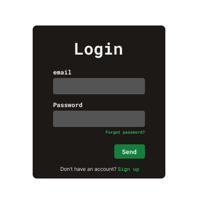

# Projeto - Tela de login

## Desafio
Você deve construir uma tela de login que se pareça o máximo possível com o design proposto.

**Nesse desafio você deve ter conhecimentos de HTML e CSS**

## Como começar
Crie uma pasta com o seu nick(ou nome) e copie os arquivos necessarios da pasta '1-StarterPack'(imagens e afins...). 
O arquivo 'style-guide' contém instruções de cores, tamanhos, fontes e tudo mais necessário sobre o layout.
Na pasta design há imagens do layout final.

### Obrigatório
- A tela deve ser responsiva para desktop, tablets e celulares.
- O design de cores e fontes deve corresponder ao layout proposto
- O usuário deve conseguir escrever um e-mail e uma senha. A senha não deve aparecer os caracteres.

### Extras
você pode tornar o desafio mais dificil utilizando javascript para:
- Validar se o usuário está colocando um e-mail válido.
- Validar se o usuário está colocando uma senha de no mínimo 6 ou 8 caracteres
- Mostrar mensagens de erros caso alguma validação esteja incorreta.

## Deploying your project

Abaixo uma lista de sites para colocar seu projeto no ar caso quiser: 

- [GitHub Pages](https://pages.github.com/)
- [Vercel](https://vercel.com/)
- [Netlify](https://www.netlify.com/)

